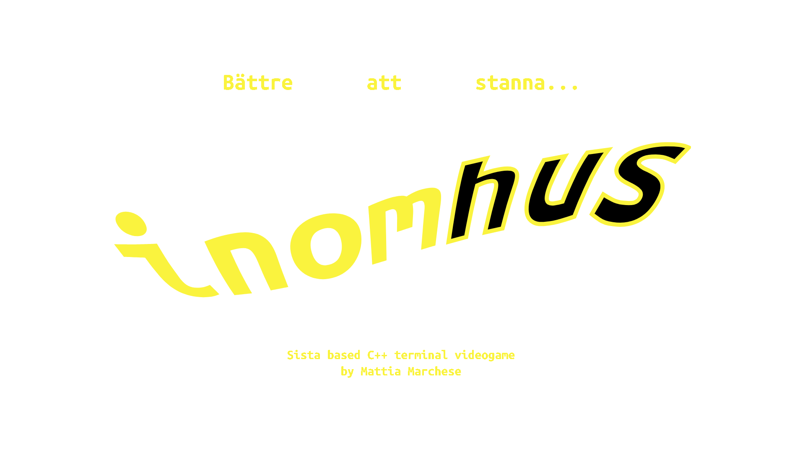
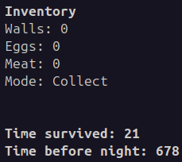

# Inomhus

*Bättre att stanna **inomhus*** (better be **in the house**) is a [Sista](https://github.com/FLAK-ZOSO/Sista) based C++ terminal videogame.



## Description

https://github.com/user-attachments/assets/629db96e-2434-4d33-a6dc-4483e72f2e3b

Your character is represented by the `$` symbol and is happy to live in a 2D grid world; there are chickens (`%`) laying eggs (`0`) that the you can eat, chests (`C`) that may contain bricks and food, and comfortable walls (`#`) that can be used to build a house.

However the world is not as friendly as it may seem at daylight, there are snakes (`~`) that eat the precious eggs, weasels (`}`) that hunt the chickens, threatening blind zombies (`Z`) that will follow you around and that you should better not bump, archers (`A`) that will shoot you from a distance.

But, as it often happens in life, the worst enemy is yourself: when the night comes the character goes **out of control** and as a player you cannot control your character anymore, you can only watch it move around, destroy its own inventory and put itself in real danger.

Will you be able to build a house before the night comes? When it happens all the gates (`=`) will be closed and your fury will be unleashed.

## Installation

### From source

```bash
git clone https://github.com/FLAK-ZOSO/Inomhus
cd Inomhus
make
```

If you don't have `make` installed you can copy and paste the following commands in your terminal.

```bash
g++ -std=c++17 -Wall -g -c -static include/sista/ANSI-Settings.cpp include/sista/border.cpp include/sista/coordinates.cpp include/sista/cursor.cpp include/sista/field.cpp include/sista/pawn.cpp
g++ -std=c++17 -Wall -g -c -static inomhus.cpp -Wno-narrowing
g++ -std=c++17 -Wall -g -static -o inomhus inomhus.o ANSI-Settings.o border.o coordinates.o cursor.o pawn.o field.o
rm -f *.o
```

If you compile the game from source you will be able to customize the game.

```c
#define DAY_DURATION 700
#define NIGHT_DURATION 200

#define WIDTH 70
#define HEIGHT 30
```

These are some of the constants that you can change in the `inomhus.cpp` file.

```c
std::bernoulli_distribution Egg::hatchingDistribution(0.26); // 26%
std::bernoulli_distribution eggSelfHatchingDistribution(0.001); // 0.1%
std::bernoulli_distribution Chicken::eggDistribution(0.0075); // 0.75%
std::bernoulli_distribution Chicken::movingDistribution(0.75); // 75%
std::bernoulli_distribution Archer::movingDistribution(0.25); // 25%
std::bernoulli_distribution Archer::shootDistribution(0.005); // 0.5%
std::bernoulli_distribution Walker::movingDistribution(0.30); // 30%

std::bernoulli_distribution walkerSpawnDistribution(0.003); // 0.3%
std::bernoulli_distribution archerSpawnDistribution(0.004); // 0.4%
std::bernoulli_distribution weaselSpawnDistribution(0.01); // 1%
std::bernoulli_distribution snakeSpawnDistribution(0.01); // 1%
std::bernoulli_distribution wallSpawnDistribution(0.01); // 1%
```

Having access to the source code you can also change the probabilities of the events that happen in the game, like the spawn of the enemies or the hatching of the eggs.

### From binary

Go to the [repository](https://github.com/FLAK-ZOSO/Inomhus) page and download the executable for your system.

- [Linux](https://github.com/FLAK-ZOSO/Inomhus/blob/main/inomhus)
- [Windows](https://github.com/FLAK-ZOSO/Inomhus/blob/main/inomhus.exe)
- [MacOS](https://github.com/FLAK-ZOSO/Inomhus/blob/main/inomhusApple)

## Usage

Open your ANSI terminal - on Windows you should use Windows Terminal while on Linux and MacOS you can use the default terminal - and run the executable.

```bash
./inomhus
```

```batch
inomhus.exe
```

If it doesn't seem to work and you just downloaded the executable, you may need to give it the right permissions or simply compile it from source as explained above.

If you don't want the tutorial to be played, just enter 'n' as explained in the intro screen; you shouldn't skip it the first time (also you can replay it for the sake of dismantling the instructions which are part of the field!).

Use a proper zoom, read the controls and enjoy the game.

## Controls

⚠️ - on Apple systems you will have to press `enter` for sending commands, sadly

Movement controls.

- `w` - Move up
- `a` - Move left
- `s` - Move down
- `d` - Move right

Shooting controls.

- `i` - Shoot up
- `j` - Shoot left
- `k` - Shoot down
- `l` - Shoot right

Mode controls.

- `c`/`C` - Collect
- `b`/`B` - Bullet
- `e`/`E` - Dump chest
- `=`/`0`/`#` - build Wall
- `g`/`G` - build Gate
- `t`/`T` - build Trap
- `m` - Mine
- `h` - Hatch

Game controls.

- `Q` - Quit
- `p`/`P`/`.` - Pause
- `+`/`-` - Speed up/down

## Gameplay

Start the game by moving around and collecting eggs, chests, and bricks by using the keys `i`, `j`, `k`, and `l` when in `C`ollect mode.



As shown in the screenshot, you can see the status of your inventory and the time of the day in the top right corner.

Using the same `i`, `j`, `k`, and `l` keys you can also shoot in the direction you want, but be careful, you have a limited amount of eggs to throw and you may want to hatch them instead.

When you have enough bricks you can build a house with the same directional keys in build wall mode (entered by pressing `0`, `=` or `#`), and you can place a gate within a wall in build gate mode (entered by pressing `g` or `G`).

In order to protect the chickens and their eggs you may want to build traps (build trap mode can be entered with `t` or `T`) that will catch the weasels and the snakes; you can also place mines (mine mode can be entered with `m`) that will explode when an enemy passes nearby.

When the night comes you will lose control of your character and you will have to watch it destroy its inventory and put itself in danger, so be sure to build a house, secure your inventory in a chest (that can be dropped in dump chest mode, accessible by key `e` or `E`).

## Credits

- FLAK-ZOSO for the Sista library
- Stefano Tocazzo for the trailer
- NIVIRO for the [trailer's soundtrack](https://ncs.io/TheRiot)
- [BeautifulSara3137](https://github.com/BeautifulSara3137) for the MacOS testing and executables
- ITÜK for the [event](https://gamecamp.ituk.ee/event/08dcca81-1c54-47d0-8eda-151aa7b1e956)
